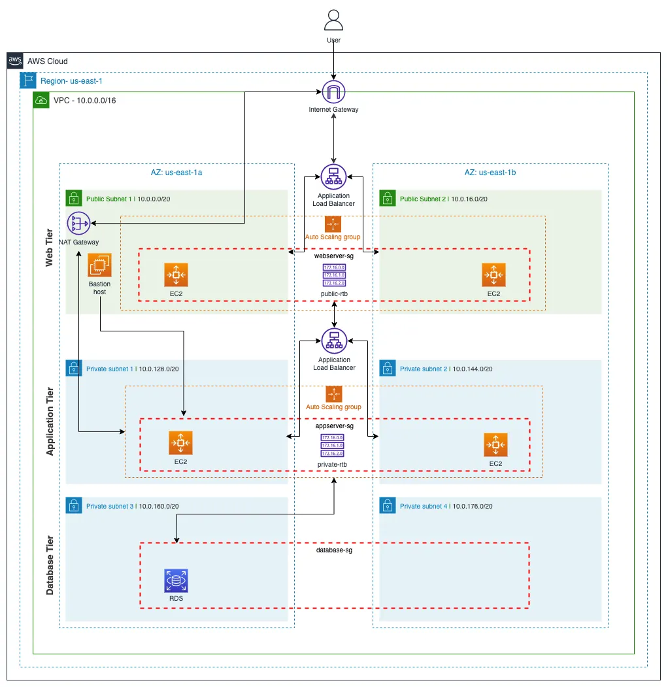

# 🚀 3-Tier Architecture Deployment on AWS

## 📌 Overview

This project demonstrates a **3-tier architecture deployed on AWS using the AWS Management Console (UI)**.
It includes Web, Application, and Database layers designed for scalability, security, and high availability.

---

## 🧱 Architecture Diagram

<p align="center">
  
</p>

---

## 🔍 Architecture Explanation

* **User** → Accesses application via browser
* **Internet Gateway** → Entry point to VPC
* **External Load Balancer** → Routes traffic to Web Tier

### 🌐 Web Tier (Public Subnet)

* EC2 instances running **Nginx**
* Handles incoming requests
* Configured with Auto Scaling

### ⚙️ Application Tier (Private Subnet)

* EC2 instances running **Node.js**
* No direct internet access
* Connected via Internal Load Balancer

### 🗄️ Database Tier (Private Subnet)

* **Amazon RDS MySQL**
* Secure and isolated
* Accessible only from App Tier

---

## ⚙️ Tech Stack

* AWS EC2
* AWS RDS (MySQL)
* AWS S3 (Private Bucket)
* Application Load Balancer
* Auto Scaling Groups
* Nginx
* Node.js

---

## 🏗️ Implementation Steps

1. Created custom VPC (`10.0.0.0/16`)
2. Configured public & private subnets
3. Created Security Groups
4. Created private S3 bucket
5. Configured IAM Role (SSM access)
6. Launched RDS MySQL
7. Deployed App Tier
8. Configured Internal Load Balancer
9. Deployed Web Tier
10. Configured External Load Balancer
11. Set up Auto Scaling Groups

---

## 🔐 Security

* Private subnets for App & DB
* No direct DB access
* IAM roles used
* Security group restrictions

---

## 🚀 Features

* High availability
* Scalable architecture
* Secure VPC design
* Real-world AWS deployment

---

## 📂 Project Structure

```bash
app-tier/
│── index.js
│── package.json
│── DbConfig.js
│── TransactionService.js
│── 3-tier.webp
│── README.md
```

---

## ▶️ How to Run

1. Launch infrastructure using AWS Console
2. Configure EC2 instances
3. Deploy application
4. Access via Load Balancer DNS

---


## ⭐ Conclusion

This project showcases a complete **manual 3-tier architecture deployment on AWS**, demonstrating strong knowledge of cloud infrastructure, networking, and security.
